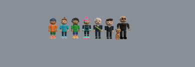
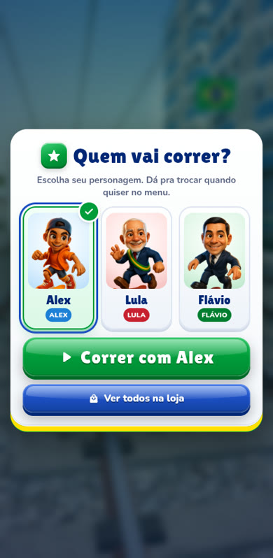
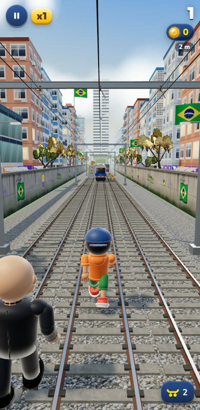
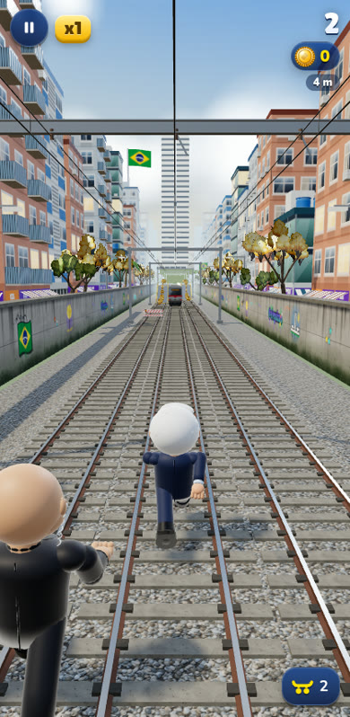
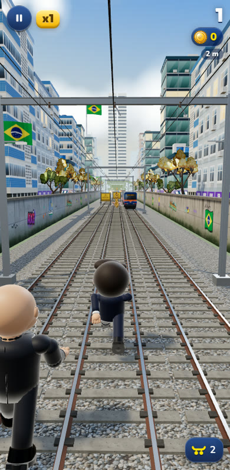
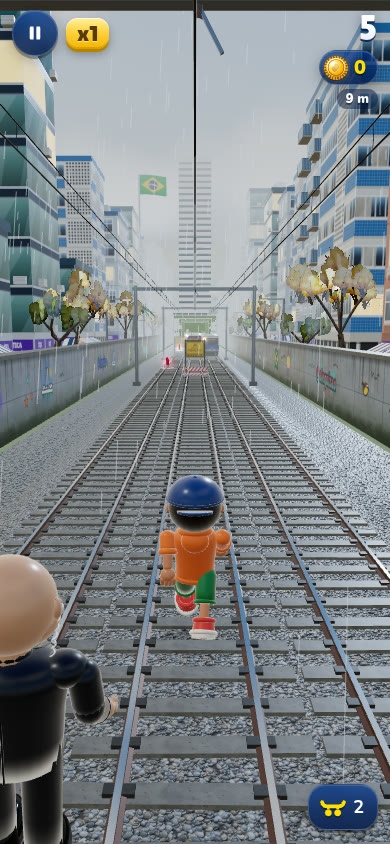
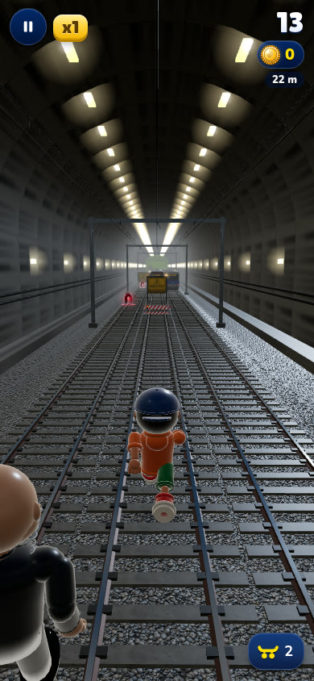
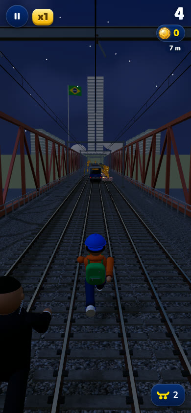
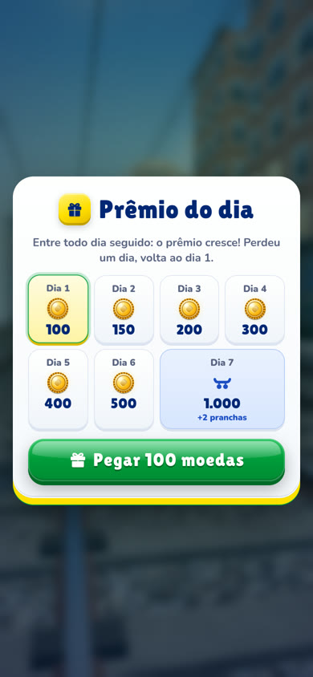
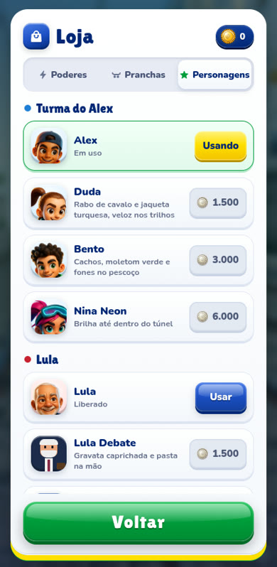

# 🚆 Nos Trilhos — Alex, Lula e Flávio numa corrida infinita 3D

[](https://alequizao.com/trilhos/)


**Nos Trilhos** junta os três jogos da série num só: escolha a **Turma do Alex**, o **Lula** ou o **Flávio** e corra pelos trilhos desviando dos trens, pegando moedas e poderes e fugindo do segurança. É um jogo de corrida infinita (*endless runner*) 3D no estilo Subway Surfers que roda direto no navegador do celular ou do computador, sem instalar, sem cadastro e de graça.

👉 **Jogue em: [alequizao.com/trilhos](https://alequizao.com/trilhos/)**

<p align="center"></p>

> Paródia de humor, sem fins políticos. Não é afiliado a partidos, ao Governo Federal, ao Senado, a Subway Surfers ou à SYBO.

## 📸 Telas do jogo

| Quem vai correr? | Alex |
|:---:|:---:|
|  |  |
| **Lula** | **Flávio** |
|  |  |
| **Chuva** | **Túnel** |
|  |  |
| **Ponte à noite** | **Recompensa diária** |
|  |  |

<details>
<summary><b>Mais telas</b></summary>


</details>

## 🎮 Como jogar

| Ação | Celular | Teclado |
|---|---|---|
| Trocar de trilho | deslizar para os lados | ← → / A D |
| Pular | deslizar para cima | ↑ / W / Espaço |
| Rolar (no ar: descer rápido) | deslizar para baixo | ↓ / S |
| Usar prancha (aguenta uma batida) | toque duplo | B / Shift |
| Pausar | botão ❚❚ | Esc / P |

## ✨ Recursos

- 👥 **Três times, sete personagens:** a Turma do Alex (Alex, Duda, Bento e Nina), o Lula e o Flávio. O jogo pergunta quem vai correr logo ao abrir. Os modelos 3D seguem o estilo das artes, com cabeça grande, olhos expressivos, luvas, tênis cartoon e *rim light*.
- ⚔️ **Duelo Lula × Flávio:** cada corrida soma pontos para o time do personagem, e o placar geral aparece no menu.
- 🎁 **Recompensa diária** com sequência de dias e **compartilhar** o placar como imagem.
- 🌦️ **Clima que muda sozinho:** sol, nublado e chuva (gotas, trilho molhado e som).
- 🌉 **Pista variada:** túnel, ponte e ciclo dia → pôr do sol → noite → amanhecer.
- 🏆 **Ranking online:** ao perder, a pessoa salva o placar com o nome ou o @ do Instagram e vê a posição.
- **Pista sempre com saída:** o gerador simula os trilhos à frente e nunca fecha todos os caminhos.
- **Continuar sempre:** com 400 moedas dá para continuar a corrida quantas vezes quiser.
- **Poderes:** Ímã de Moedas, Jatinho, Tênis Mola e multiplicador 2x, com níveis na loja.
- **Missões**, loja de visuais, som e trilha sintetizados com WebAudio.
- **PWA:** instala como app, funciona offline e se atualiza sozinho, nunca no meio da corrida.

## 🛠️ Tecnologia

- [Three.js](https://threejs.org/) r170 (WebGL), sem build, só com ES modules puros.
- Texturas desenhadas por código (canvas); artes 2D em WebP.
- PHP 7.4+ com SQLite para o ranking e o duelo.

| Arquivo | O que faz |
|---|---|
| `index.html` | telas, HUD, ícones SVG, SEO |
| `jogo.js` | regras, física, pista, câmera, loja, missões, áudio |
| `personagens*.js` | base cartoon + Turma do Alex, Lula, Flávio e o segurança |
| `biomas.js` / `clima.js` | túnel, ponte, dia/noite e clima |
| `objetos.js` / `itens.js` | trens, obstáculos, moedas e poderes |
| `social.js` / `social.css` | recompensa diária, compartilhar e duelo |
| `ranking.js` / `ranking.php` / `duelo.php` | APIs com SQLite fora da pasta pública |
| `img/personagens/` | artes 2D da tela de escolha e da loja |
| `sw.js` / `manifest.webmanifest` | PWA offline |

### Rodar localmente

```bash
git clone https://github.com/alequizao/nos-trilhos.git
cd nos-trilhos
python3 -m http.server 8080
# abra http://localhost:8080
```

O ranking e o duelo precisam de PHP com `pdo_sqlite`. Ajuste `PASTA_DADOS` em `ranking.php` e `duelo.php` para uma pasta fora do alcance da web; o banco é criado sozinho.

> A cada publicação, suba a versão (`?v=`) em `index.html`, nos `import` dos módulos, em `sw.js` (`VERSAO` e lista) e em `jogo.js`.

Veja também os jogos individuais: [Surf nos Trilhos](https://github.com/alequizao/surf-nos-trilhos), [Lula nos Trilhos](https://github.com/alequizao/lula-nos-trilhos) e [Flávio nos Trilhos](https://github.com/alequizao/flavio-nos-trilhos).

## 👨‍💻 Desenvolvedor

Jogo desenvolvido por **Alequizao**.

- **E-mail:** alequizao.dev@gmail.com
- **Instagram:** [@alequizao](https://instagram.com/alequizao)
- **GitHub:** [@alequizao](https://github.com/alequizao)
- **Site:** [alequizao.com](https://alequizao.com/)

Quer um jogo ou sistema como este? Entre em contato.

---

© 2026 Alequizao · Todos os direitos reservados. Paródia de humor, sem fins políticos e sem relação com partidos, o Governo Federal, o Senado, Subway Surfers ou SYBO.
Uso, cópia ou redistribuição somente com autorização. Three.js é distribuído sob a licença MIT pelos seus autores.
